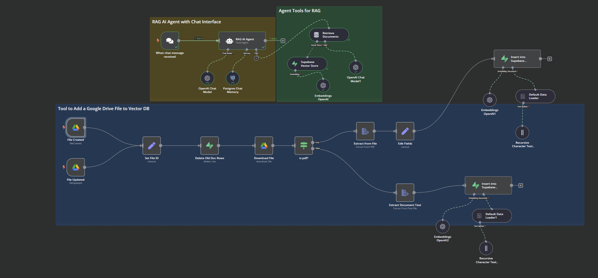

# Notes on working with the repositories here

## 1. [easy-local-rag](https://github.com/AllAboutAI-YT/easy-local-rag)
Approach: Simple demo of RAG with prior chat context (attempted)
Database: Created at runtime with python in memory
Models: mxbai-embed-large, Llama3.1
Experience: Everything kinda worked out of the box. The rewrite feature in `localrag.py` caused errors but `localrag_no_rewrite.py` worked without issue. I don't think this is capable of 1) pointing to the location in which it found an answer, 2) handling large vector databases. Moving on.

## 2. [n8n-supabase-rag](https://www.youtube.com/watch?v=PEI_ePNNfJQ)
Approach: n8n is orchestrator tool, supabase has inbuilt postgres for chat history, and vector db for embeddings. use OAI or other provider to RAG using stored chat history and vector db. Uses google drive API to sense added or modified files and add the embeddings. When files are updated the relevant embeddings are updated (uses google drive file IDs)

Database: Supabase, postgres for chat history, supabase vector store for embeddings
Experience. Works! Uploading one file at a time to google drive adds each to the vector db. I had to modify it from the [video](https://youtu.be/PEI_ePNNfJQ?si=wEYkQESJMmIBhXL0) to make it work with pdfs instead of just text. This would require additional features for batch uploads, varied filetypes (pdf, doc, csv, pptx, md).